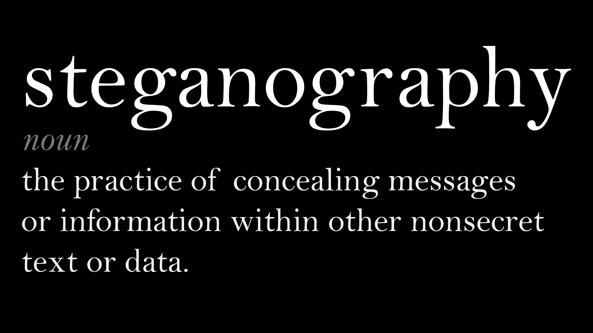

# Steganography

Mountains of information lay all around, but some hidden underneath ordinary appearances. But with tools, we can see what the naked eye cannot. Steganography is a must-learn concept for those following the path of cyber security; this project is a tool to learn and add to that arsenal.

### Setup

```powershell
git clone https://github.com/SilentisVox/Steganography
cd Steganography
pip install -r requirements.txt
```

### Usage

###### Extract
```powershell
python steganography.py --extract IMAGE.png [--out-file DATA.bin]
```

###### Implant
```powershell
python steganography.py --implant IMAGE.png --in-file DATA.bin --out-file NEW.png
```

## Brief Explanation



### What is Steganography?

Steganography is the practice of concealing information. It involves hiding data within an ordinary, non-secret file or message to prevent detection. The hidden information is being extracted at the receiving end. Often, steganography is combined with encryption to add an extra layer of security for the hidden data. With the help of Steganography, we can hide any digital content virtually like text, image, videotape, etc.

The term "steganography" is derived from the Greek word "steganos" which means "hidden or covered" and "graph" means "to write." It has been in use for centuries. For example, in ancient Greece, people carved messages onto wood and covered them with wax to hide it. Similarly, Romans used different types of invisible inks which could be revealed when exposed to heat or light.

### How Steganography Works with Images

Because PNGs are made up of pixels, we are able to take advantage of how these colors are stored. These values are typically stored as bytes. Steganography subtly alters these bits, embedding hidden information without visibly changing the image.

### Least Significant Bit

The least significant bit is the final, smallest-impact bit in a byte. Slight changes to this bit minimally affect the pixel’s color, making alterations imperceptible visually. By encoding information into the LSBs across many pixels, messages can be hidden seamlessly within images.

### Example of LSB Steganography

###### Original Pixel Values

```
Red:   11001100
Green: 10111001
Blue:  11101011
Alpha: 11111111
```

###### Data To Hide

```
1
0
1
0
```

###### New Pixel Values

```
Red:   1100110(0) -> 1100110(1)
Green: 1011100(1) -> 1011100(0)
Blue:  1110101(1) -> 1110101(1)
Alpha: 1111111(1) -> 1111111(0)
```

The slight change remains undetectable, and yet it conceals the hidden data.